# Dom Manipulation Assignment

# 1. Webiste Name: [Dev To](https://dev.to/)

### Topics

    - Query Selctory, Inner HTML

### Sample Image


### Tasks

        Target the Top description div and change the DEV Community to <Your_Name> and description to your passion

### Output


# Edit: Solution 
## Code 
```js
document.getElementsByClassName("c-link c-link--branded")[1].textContent = "Samir Mishra";
document.getElementsByClassName("color-base-70 mb-4")[1].textContent = "Web Developer"
```
## Output
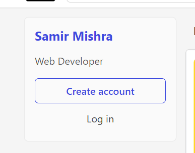

# 2. Website Name: [Apple](https://support.apple.com/en-in)

### Task


### Fetch all the product name and store in an array

### Output

['iPhone', 'Mac', 'iPad', 'Watch', 'AirPods', 'Music', 'TV']

# Edit: Solution
## Code
```js
let appleProducts = [];
const elementsList = document.getElementsByClassName("as-imagegrid-item-title");
for (element of elementsList) {
    productName = element.innerText;
    appleProducts.push(productName.replace("\nSupport", ""));
}
console.log(appleProducts);
```
## Output
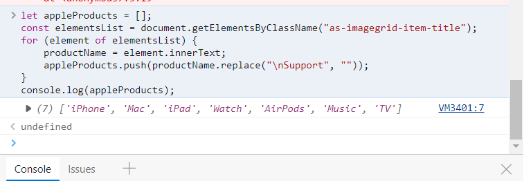

# 3. Webiste Name: [Youtube Support](https://support.google.com/youtube/)

### Topics

    - Get Element By Id, Create Element, Create Text Node, Append Child

### Sample Image


### Tasks

     Add another FAQ 'My New FAQ' to the list

### Output


# Edit: Solution
## Code 
```js
let faqSection = document.getElementsByClassName("accordion-homepage")[0];

let newElement = document.createElement("section");

let headingElement = document.createElement("h3"); 

let textContent = document.createTextNode("My New FAQ");

headingElement.appendChild(textContent);
newElement.appendChild(headingElement);
faqSection.appendChild(newElement);
newElement.classList.add("parent")
```

## Output
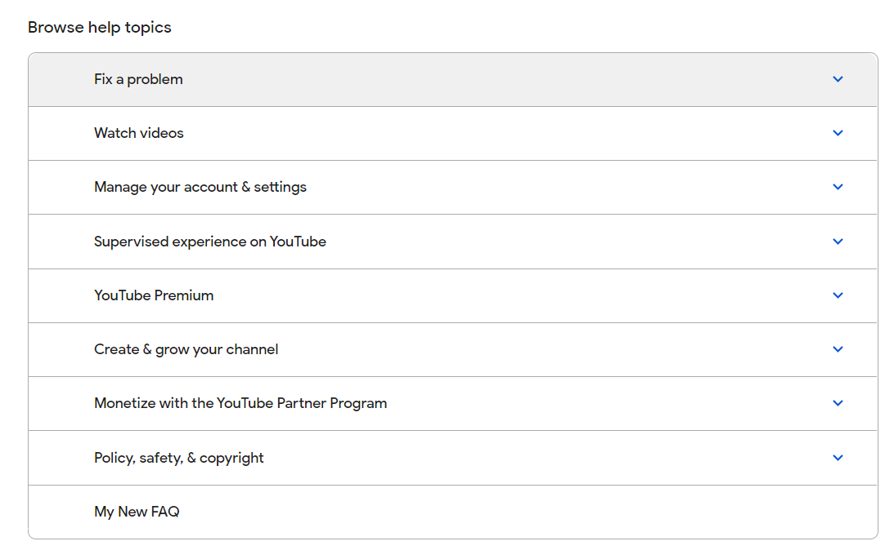

# 4. Webiste Name: [OnePlus](https://www.oneplus.in/support)

### Topics

     Query Selector, InnerText

### Sample Image


### Tasks

      Change the contact number

### Output


# Edit: Solution
## Code 
```js
let phoneNo = document.querySelector(".one-tel-number.service-number");
phoneNo.innerText = "+91 99988 77666";
```

## Output
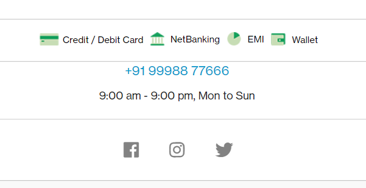

# 5. Webiste Name: [Samsung](https://www.samsung.com/in/offer/online/samsung-fest/)

### Topics

       getElementById, createElement, InnerText, append, setAttribute

### Sample Image


### Tasks

     Target the main div of card and change the Button text to Check out

### Output


# Edit: Solution
## Code
```js
let elements = document.getElementsByClassName("diwali-deals-product-sale-btn");
elements[16].innerText = "Check Out";
```

## Output
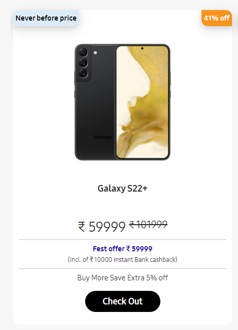

# 6. Webiste Name: [Adidas](https://www.adidas.co.in/)

### Topics

    -   Query Selector, Event listeners, Changing Styles

### Sample Image


### Tasks

     Target the search box and on hover change thebackground color to red.

### Output


# Edit: Solution
## Code
```js
const searchBar = document.querySelector(".searchinput___19uW0");

searchBar.addEventListener("mouseover", function () {
    document.querySelector(".searchinput___19uW0").style.backgroundColor = "#F96666";
})
searchBar.addEventListener("mouseout", function () {
    document.querySelector(".searchinput___19uW0").style.backgroundColor = "#eceff1";
})
```
## Output

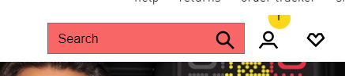


# 7. Webiste Name: [MDN Web Docs](https://developer.mozilla.org/en-US/)

### Topics

       Form, Value, Submit

### Sample Image


### Tasks

     To Search a topic in the MDN Search bar.
     First add a text to search in the search bar and then hit the submit search button to search the docs using DOM

### Output


# 8. Webiste Name: [Google](https://www.google.com/)

### Topics

       Remove Elements

### Sample Image


### Tasks

     Remove alternate languages from the home page languages listed

### Output

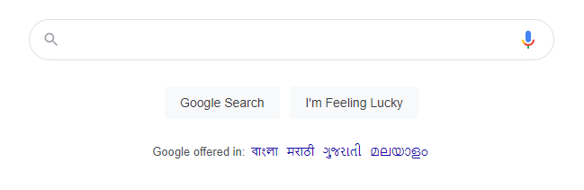

# Edit: Solution
## Code
```js
// Get the element containing languages link
const languages = document.getElementById("SIvCob");
// Get half the length of the childElementCount
halfLength = Math.ceil((languages.childElementCount/2));

for (i = 0; i < halfLength; i++) {
        languages.children[i].remove();
}
// Explanation: Every time we remove an element from the collection,
// The length of the HTMLCollection will change. So we will increment
// The number by 1 each time to remove every other element in the collection 
```

## Output
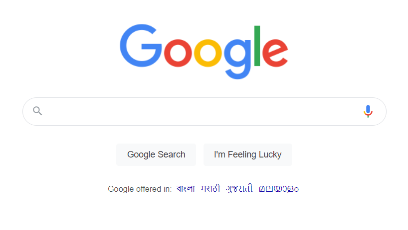

# 9. Webiste Name: [Code Wars](https://www.codewars.com/)

### Topics

       Change Font Family, Color of Text.

### Sample Image


### Tasks

    Change the font family of the text to monospace and text color to the logo’s background color.

### Output


# Edit: Solution
## Code
```js
const heading = document.querySelector("h1.display-heading-1");
heading.style.fontFamily = "monospace";
heading.style.color = "#b1361e";

```
## Output


# 10. Webiste Name: [Freecodecamp](https://www.freecodecamp.org/)

### Topics

       querySelector, mouseover, click eventListener,  callback function, style,

### Sample Image


### Tasks

    Target the button and change background colour on mouseover

### Output


# Edit: Solution
## Code
```js
const loginButtonText = document.querySelector("login-btn-text");

loginButtonText.addEventListener("mouseover", function (event) {
    loginButtonText.style.backgroundColor = "#8BBCCC";
})
loginButtonText.addEventListener("mouseout", function (event) {
    loginButtonText.style.backgroundColor = "transparent";
})
```
## Output
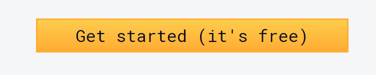
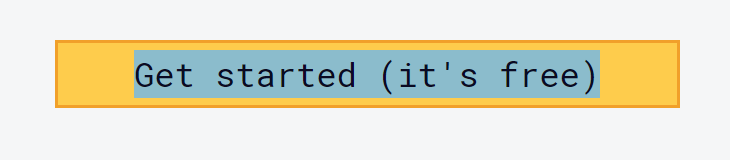


# 11. Webiste Name: [realme](https://www.realme.com/in/)

### Topics

       querySelector,style,background-image

### Sample Image


### Tasks

    change the realme logo to ineuron logo

### Output


# Edit: Solution
## Code
```js
const logo = document.getElementsByClassName("icon icon-logo in")[0];
logo.style.backgroundImage = "url(https://ineuron.ai/images/ineuron-logo.png)";
```

## Output
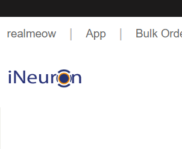


# 12. Webiste Name: [Github](https://github.com/)

### Topics

       querySelector,style,background-Color

### Sample Image


### Tasks

     change the background colour of the button to blue.

### Output


# Edit: Solution
## Code
```js
const button = document.querySelector(".btn-primary.btn");
button.style.backgroundColor = "#47B5FF"
```

## Output


# 13. Webiste Name: [Hackerrank](https://www.hackerrank.com/)

### Topics

       querySelector,innerHtml

### Sample Image


### Tasks

    Target the top description and change “Matching developers with great companies” to ‘JSBOOTCAMP“.

### Output


# Edit: Solution
## Code
```js
const headingText = document.querySelector(".fl-heading-text");
headingText.innerHTML = "JSBOOTCAMP!";
```

## Output
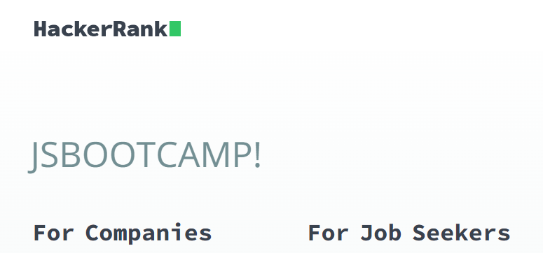


# 14. Webiste Name: [Asus](https://www.asus.com/in/)

### Topics

    querySelector,style,font-size

### Sample Image


### Tasks

       change the fontsize of “Hot Deals” to 80px

### Output


# Edit: Solution
## Code
```js
document.querySelector(".HotDealsAll__Heading__2fIbe").style.fontSize = "80px";
```

## Output
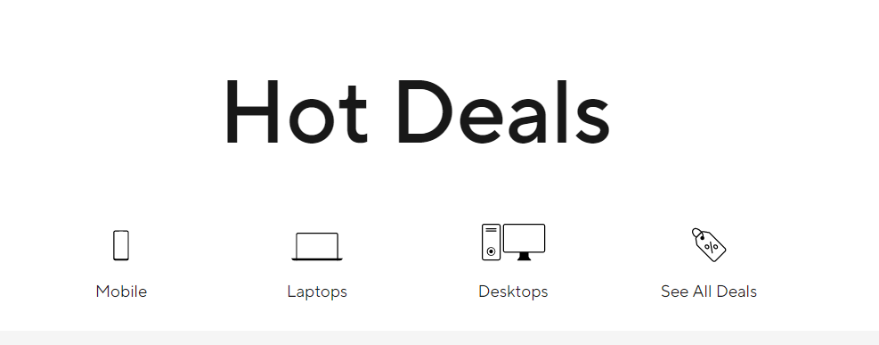

<!-- 15. Webiste Name: [Dell](https://www.dell.com/en-in/shop/deals/laptop-deals?gacd=10415953-9016-5761040-285981356-0&dgc=ST&gclid=Cj0KCQjwguGYBhDRARIsAHgRm4-XUDMhhVNyHXb3s1gY4ZBzORr_d9Se-buhJwy7asyUe7YdqEA11eEaAt6UEALw_wcB&gclsrc=aw.ds&nclid=BxjBlpBQsX6pjSHh-L8YYSU77EpfXRkG1AGMB5Wbeu386ykspfrPDnfx_DdFau20) -->
# 15. Website Name: [Dell](https://www.dell.com/en-in/shop/deals/)

### Topics

    querySelector,style.textAlign

### Sample Image


### Tasks

    Convert the text “G15 Gaming Laptop” from left to right

### Output


# Edit: Solution
## Code
```js
const productTitleElements = document.querySelectorAll(".ps-title");
productTitleElements[6].style.textAlign = "right";
```

## Output
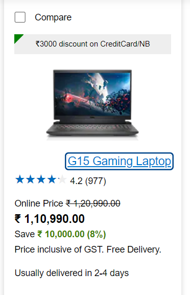


# 16. Webiste Name: [Vercel](https://vercel.com/)

### Topics

    querySelector,innerHTMl

### Sample Image


### Tasks

    change the heading “Start with the developer” to “Start with Scratch”

### Output


# Edit: Solution
## Code
```js
document.querySelector(".section-title_title__VEDfK").innerHTML = "Start with Scratch";
```

## Output
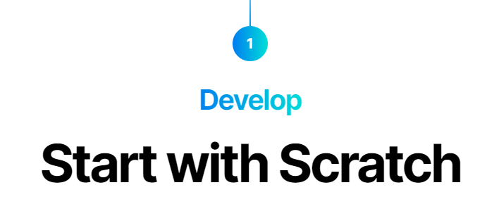


# 17. Webiste Name: [Sony](https://www.sony.co.in/)

### Topics

    querySelector,innerHTMl

### Sample Image


### Tasks

     change the button text To current Date.

### Output


# Edit: Solution
## Code
```js
const buttonContainer = document.querySelector(".btn-container");
buttonContainer.innerHTML = new Date();
// Fri Sep 30 2022 02:22:48 GMT+0530 (India Standard Time)
```

## Output
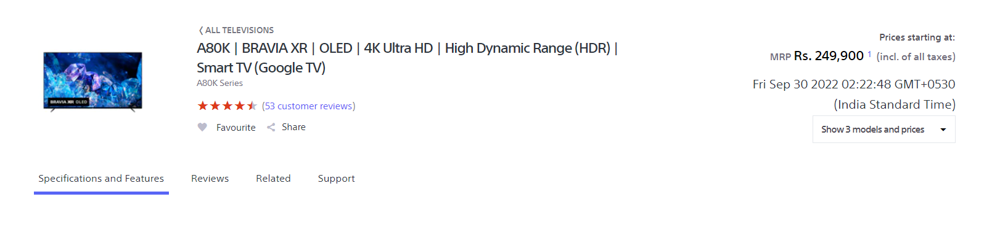


# 18. Webiste Name: [Philips](https://www.philips.co.in/)

### Topics

    querySelector,style,backgroundcolor

### Sample Image


### Tasks

    change the background colour blue to orange

### Output


# Edit: Solution
## Code
```js
const footerSection = document.querySelector("footer.p-f03-footer-container");
footerSection.style.background = "linear-gradient(to bottom right,#ef7215 0,#fd6a02 50%,#fda50f 100%)";
```

## Output
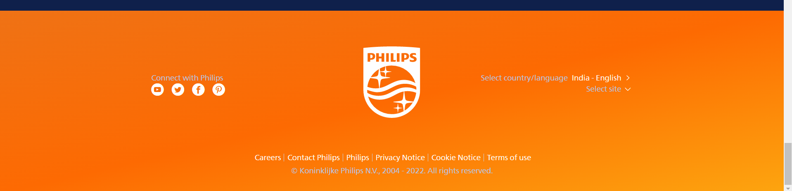


# 19. Webiste Name: [Canon](https://in.canon/)

### Topics

        querySelector,src

### Sample Image


### Tasks

        extract the canon logo

### Output


# Edit: Solution
## Code
```js
document.querySelector(".logo").src;
```

## Output
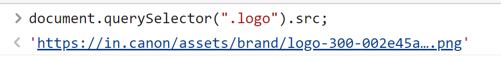
        https://in.canon/assets/brand/logo-300-002e45a4aec98fd92899838da9d5560f.png

# 20. Webiste Name: [Oppo](https://www.oppo.com/in/)

### Topics

        querySelector,style,color

### Sample Image


### Tasks

        Change the description colour black to orange

### Output


# Edit: Solution
## Code
```js
const descElements = document.querySelectorAll(".desc");
descElements[0].style.color = "orange"
```

## Output
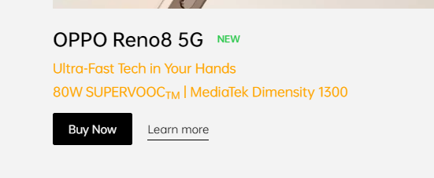